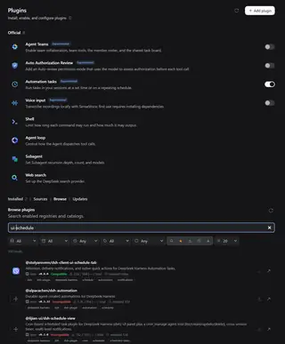

# Registry Aggregator for DeepSeek Harness 0.2.x

Registry Aggregator adds federated plugin discovery and update discovery around the native DeepSeek Harness Plugin Manager.

This is the clean DSH `0.2.0` implementation line. It does **not** carry DSH `0.1.x` compatibility code.

Current stable version: `0.5.2`  
Current validation baseline: DSH `v0.2.0-rc.2`  
Declared DSH compatibility: `>=0.2.0-rc.2 <0.3.0`

Compatibility badges are evaluated against the DSH version that is actually running rather than a hardcoded RC value.

## Screenshot

Real Harness UI, manually verified on DSH `0.2.0-rc.2`:



## Install from npm

```powershell
$DSH_VERSION = "0.2.0-rc.2"
$PROFILE = "dsh-020-test"
$env:DSH_HOME = "$env:USERPROFILE\.dsh-020-test"

pnpm dlx "@deepseek-ai/dsh@$DSH_VERSION" plugin --profile $PROFILE add "@stolyarovmn/dsh-ui-registry-aggregator@0.5.2"
pnpm dlx "@deepseek-ai/dsh@$DSH_VERSION" --profile $PROFILE
```

## What it adds

The native Plugin Manager remains responsible for installation, enable/disable, uninstall, and bundle lifecycle. Registry Aggregator adds discovery, compatibility evidence, metadata, and update orchestration.

### Main Plugins page

On DSH `0.2.0-rc.2`, Registry Aggregator extends the main Plugins list with:

- `Installed | Sources | Browse | Updates` navigation using the native Installed heading/count visual language;
- the original native Installed cards as the **Installed** view;
- **Sources**, **Browse**, and **Updates** directly on the main Plugins page;
- a numeric update count beside **Updates**;
- `Update → vX.Y.Z` directly on an installed package when a newer eligible version is available;
- **Update all** for eligible updates, processed sequentially with Registry Aggregator updating itself last;
- automatic teardown of the main-page surface when the Plugin Manager opens a bundle/detail page.

The supported `plugins.bundle.config` detail view remains available as a fallback inside **Installed → Registry Aggregator**.

> **DSH 0.2.0-rc.2 integration note:** stock rc.2 does not expose a list-level Plugin Manager slot. The main-page integration is therefore an explicit rc.2 compatibility bridge. It waits until the native Plugin Manager inventory has finished loading, does not use a `MutationObserver`, and removes itself on detail pages. When DSH exposes an appropriate list-level slot, this bridge should be replaced by the supported slot API.

### Sources

- built-in npm and GitHub sources;
- custom JSON and corporate catalog sources;
- enable/disable, add, remove, refresh, copy-address, package/repository count, health, and error state;
- live configuration through `ctx.configForms.get('registry-aggregator')`;
- authenticated Host RPC through the DSH Connection service;
- bounded responses, request timeouts, redirect validation, DNS pinning, and private-network blocking.

### Browse

- federated search across enabled npm, GitHub, custom JSON, and corporate sources;
- popular/default results when the query is empty;
- compact source, release, freshness, tag, compatibility, and page-size filters;
- combinable sorting by relevance, stars, downloads, freshness, and name;
- multi-criterion percentile-normalized composite ranking;
- 20 / 50 / 100 pagination;
- explicit package versions;
- GitHub stars and release/repository freshness;
- npm `30d | total` download evidence resolved lazily for visible npm rows;
- package artwork from the DSH manifest icon contract, with safe repository-local README artwork fallback for npm packages that expose GitHub metadata;
- `Compatible`, `Incompatible`, and `Not verified` evidence against the actual running DSH version;
- compatibility filtering;
- icon-only one-click installation through native `remote.pluginManager.inspect()` → `installBundle()`;
- known-incompatible packages are disabled before installation is attempted.

### Updates

- update discovery from native installed bundles plus latest npm manifests;
- per-package update through the native Plugin Manager;
- package Update uses a two-arrow glyph while content/list Refresh keeps the single-arrow glyph;
- native installed artwork is reused when available;
- sequential **Update all**;
- explicitly incompatible update targets remain disabled;
- Registry Aggregator updates itself last so it cannot interrupt the remaining queue.

## Architecture

```text
DSH Plugins
  ├─ Installed | Sources | Browse | Updates
  │   ├─ Installed
  │   │   ├─ native DSH package cards
  │   │   └─ Update → vX.Y.Z
  │   ├─ Sources
  │   ├─ Browse
  │   └─ Updates
  │       └─ Update all
  │
  └─ Installed → Registry Aggregator
      └─ plugins.bundle.config
          ├─ Sources
          ├─ Browse
          └─ Updates

Sources UI
  ├─ ctx.configForms.get('registry-aggregator')
  │    ├─ snapshot subscription
  │    └─ form.mutate(...) → Host Config.sources
  └─ ctx.connection.rpc.call
       └─ /api/plugin-sources/{health,counts,browse,icons,metadata,download-stats}
            └─ Host source adapters
                 ├─ npm
                 ├─ GitHub
                 ├─ custom-json
                 └─ corporate

Plugin lifecycle
  └─ native DSH remote.pluginManager
       ├─ inspect(spec)
       ├─ installBundle(spec)
       └─ listBundles() / plugin-manager/changed
```

## Known limitations

- build-script approval remains in the native **Add plugin** dialog;
- **Update all** cancellation is not implemented; eligible updates run sequentially once started;
- automatic update discovery does not yet cover GitHub-only installed dependencies without npm package identity;
- the main Plugins-list surface is a version-pinned DSH `0.2.0-rc.2` compatibility bridge because rc.2 has no supported list-level Plugin Manager slot.

## Validation

`0.5.2` was promoted from the manually verified `0.5.2-rc.6` candidate after:

- JavaScript syntax checks;
- repository unit/client contract tests;
- `npm pack --dry-run` validation;
- isolated install smoke test against DSH `0.2.0-rc.2`;
- real Harness UI verification of the main Plugins-page Browse integration shown above.

## Test from GitHub

For unreleased development builds, use a commit SHA instead of publishing a test package:

```powershell
$DSH_VERSION = "0.2.0-rc.2"
$PROFILE = "dsh-020-test"
$COMMIT = "<commit-sha>"
$env:DSH_HOME = "$env:USERPROFILE\.dsh-020-test"

pnpm dlx "@deepseek-ai/dsh@$DSH_VERSION" plugin --profile $PROFILE add "github:Stolyarovmn/dsh-ui-registry-aggregator#$COMMIT"
pnpm dlx "@deepseek-ai/dsh@$DSH_VERSION" --profile $PROFILE
```

## Historical lines

- `dsh-0.1.7` — stable `v0.4.17` line for DSH `0.1.7-rc.2`.
- `dsh-0.1.5` — historical DSH `0.1.5-rc.3` compatibility line.
- `main` — neutral project landing branch.
